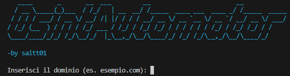

# 🕵️‍♂️ OsintAutomator – by Saitt01

**OsintAutomator** è un tool scritto in **Python** che automatizza la raccolta di informazioni pubbliche (OSINT) su un dominio.  
È stato progettato per essere semplice da usare, modulare e facilmente estendibile.  
Perfetto per attività di **Information Gathering**, **Recon**, e come base per progetti di **Threat Intelligence** o **Penetration Testing**.

---

## 🚀 Funzionalità incluse

Il tool esegue automaticamente:

- 🔍 **WHOIS Lookup** (via API)
- 🌐 **Enumerazione sottodomini** (via crt.sh)
- 🧠 **DNS Enumeration** (A, AAAA, MX, TXT, NS, CNAME)
- 🔐 **Analisi certificato SSL/TLS** (validità, issuer, cifratura)
- 📡 **Header HTTP Analysis** (sicurezza, proxy, redirect)
- 🌍 **IP Geolocation & Hosting** (cloud provider, ASN, città, reverse DNS)

Ogni modulo salva anche un **report dedicato** in formato `.txt` nella cartella `/output`.

---

---

## 🛠️ Setup & Installazione

### 1. Clona il repository:

git clone https://github.com/Saitt01/Python-Script-CyberSec.git

cd Python-Script-CyberSec.git

cd OsintAutomator

### 2. Installa le dipendenze:
pip install -r requirements.txt

### 3. Esegui il tool:
python main.py

## 📂 Struttura dei file
OsintAutomator/

├── main.py                         # Entry point del tool

├── requirements.txt                # Dipendenze Python

├── output/                         # Report generati in .txt

└── moduli/
    
    ├── whois_lookup.py
    ├── subdomain_enum.py
    ├── dns_enum.py
    ├── header_analyzer.py
    ├── ssl_tls_analyzer.py
    └── ip_lookup.py

## ✅ Dipendenze
requests

dnspython

colorama

pyfiglet

### Installa tutto con:

pip install -r requirements.txt

## 📌 Note importanti
Per il modulo WHOIS, è necessario inserire una API key valida da WhoisXMLAPI.
→ Puoi sostituire questo modulo con una versione free o mock se vuoi usarlo senza limiti.

Tutti i moduli sono indipendenti: puoi riusarli o modificarli singolarmente per integrarli in altri progetti.

## 👨‍💻 Autore
Creato da Andrea Saitta (@Saitt01)

## 📢 Licenza
Distribuito sotto licenza MIT.
Puoi usarlo liberamente per progetti personali, test, educazione.

## 🔮 Prossimi step 
OsintAutomator è solo l'inizio. Ogni modulo è stato creato per essere scalabile e migliorabile man mano che le mie competenze cresceranno! c: