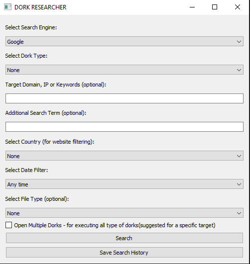

# 🔍 Dork Researcher – Python OSINT Tool with GUI

**Dork Researcher** is a lightweight OSINT tool with a graphical interface built in **Python + PyQt5**.  
It allows you to generate and launch Google Dorks and custom search queries across multiple search engines with just a few clicks.

> ⚡️ A simple yet powerful way to uncover exposed files, login panels, configuration data, and more.

---

## 🧠 Key Features

✅ Auto-generates search queries based on dork categories  
✅ Supports multiple search engines: **Google, Bing, DuckDuckGo**  
✅ Search filters:
- Country-specific domains (`.it`, `.de`, `.jp`, etc.)
- File types (`.pdf`, `.sql`, `.xlsx`, etc.)
- Time-based filters (last 24h, week, month, year)

✅ Optional **multi-dork mode** – run all dorks at once  
✅ Save search history to a `.csv` file  

---

## 🖼️ GUI Preview



---

## 📦 Requirements

- Python 3.x  
- PyQt5  
- pandas  

Install dependencies:

```bash
pip install -r requirements.txt
```

Or manually:

```bash
pip install PyQt5 pandas
```

---

## 🚀 How to Use

1. **Clone the repository**:

```bash
git clone https://github.com/Saitt01/Python-Script-CyberSec.git
cd Python-Script-CyberSec.git
cd dorkResearcher
```

2. **Launch the app**:

```bash
python dorkResearcher.py
```

3. **Use the GUI**:
   - Fill in the fields (search engine, dork type, target, filters, etc.)
   - Click **Search** to launch the query in your browser
   - Enable **Multi-Dork Mode** to run all dorks at once
   - Click **Save Search History** to export the results

---

## 💡 Use Cases

- Audit your own domain for exposed sensitive content  
- Perform OSINT investigations or competitive research  
- Search for open directories, SQL errors, or email lists  
- Find publicly accessible webcam feeds  
- Perfect for **CTF challenges** and **ethical hacking training**

---

## ⚠️ Disclaimer

> This tool is for **educational and authorized use only**.  
> The developer is **not responsible** for any misuse or illegal activity.  
> Always get **explicit permission** before scanning or testing any system.

---

## 👨‍💻 Author

Built by **Andrea Saitta**  
🔗 [LinkedIn](https://www.linkedin.com/in/andrea-saitta-18631125a/)  

---

## ⭐️ License

This project is licensed under the **MIT License** – see the [`LICENSE`](LICENSE) file.
